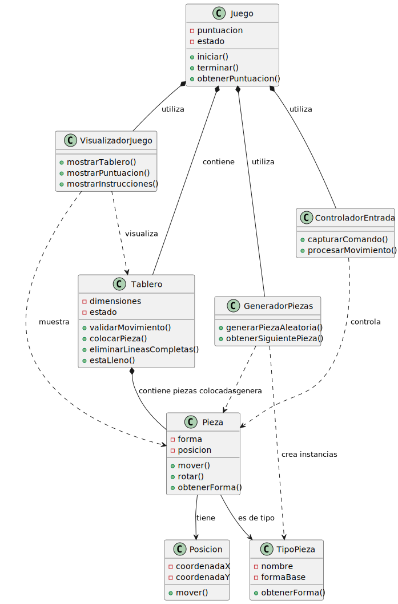

|Observar||Conceptualizar||Decidir||Construir||Ejecutar|
|:-:|:-:|:-:|:-:|:-:|:-:|:-:|:-:|:-:|
|[Modelo del dominio](/docs/modeloDelDominio.md)|>>|[Requisitos](/docs/ProcesoRequisitos.md)|>>|[***Análisis***](/docs/ProcesoAnalisis.md)|>>|[Decisiones tecnológicas](/docs/DecisionesTecnologicas.md)|>>|[Diseño](/docs/ProcesoDiseño.md)|>>|[Código](/src/)

# Actores y Casos de Uso

## Actores identificados

- **Jugador**: Persona que interactúa con el juego, controla las piezas y toma decisiones.
- **(Opcional futuro) Administrador**: Podría configurar parámetros, ver estadísticas, etc.
- **(Opcional futuro) Observador**: Visualiza partidas, pero no interactúa.

> **Nota:** Un actor es siempre una entidad externa al sistema que interactúa con él. El propio software o sistema NO es un actor, sino el sujeto de los casos de uso.

## Casos de uso principales

### Básicos (Tetris clásico)
- Iniciar partida
- Mover pieza (izquierda/derecha)
- Rotar pieza
- Acelerar caída de pieza
- Pausar/reanudar partida
- Finalizar partida
- Ver puntuación
- Limpiar línea
- Mostrar siguiente pieza (si se implementa)

### Casos de uso extendidos (para futuras versiones)
- Cambiar nivel de dificultad
- Guardar/cargar partida
- Consultar estadísticas
- Configurar controles
- Jugar en modo multijugador
- Ver ranking de puntuaciones
- Activar/desactivar sonido
- Personalizar apariencia
- Usar pieza en "hold" (reserva)
- Ver repetición de partida

---

# Proceso de análisis

El **análisis** es la fase donde identificamos y modelamos **QUÉ** debe hacer el sistema, sin preocuparnos por **CÓMO** lo implementaremos. Nos enfocamos en entender el problema del dominio y sus conceptos fundamentales.

## Metodología seguida

### 1. Punto de partida: modelo del dominio

El **análisis** parte del [modelo del dominio](../modelosUML/ModeloDominio.puml) previamente elaborado, que identifica los conceptos puros del mundo real:

- `Juego`, `Tablero`, `Pieza`, `TipoPieza`
- `Celda`, `Linea`, `Movimiento`, `Turno`

**Pregunta clave:** *¿Cómo transformamos estos conceptos del dominio en clases de software?*

### 2. Refinado de conceptos para software

**Del dominio al software:** Analizamos qué conceptos del dominio se mantienen como clases y cuáles se transforman:

|Sustantivos identificados
|-
|Juego
|Tablero
|Pieza
|Línea
|Puntuación
|Jugador
|Movimiento
|Posición

**Transformación dominio → análisis:**

|Concepto del dominio|Decisión en análisis|Justificación|
|-|-|-|
|`Juego`|Se mantiene como clase|Concepto central que coordina todo|
|`Tablero`|Se mantiene como clase|Área donde ocurre la acción|
|`Pieza`|Se mantiene como clase|Elementos principales que manipula el jugador|
|`TipoPieza`|Se mantiene como clase|Diferentes formas (I, O, T, L)|
|`Posicion`|Se extrae como clase|Ubicación de las piezas (extraída de Pieza)|
|`Celda`|Se absorbe en Tablero|Implementación interna del tablero|
|`Linea`|Se convierte en operación|`eliminarLineasCompletas()` en Tablero|
|`Movimiento`|Se convierte en operaciones|`mover()`, `rotar()` en Pieza|
|`Turno`|Se absorbe en flujo de control|Game loop en la clase principal|

**Nuevas clases identificadas para software:**

|Nueva Clase|Justificación|Origen|
|-|-|-|
|`GeneradorPiezas`|Responsabilidad de crear piezas aleatoriamente|Extraída de `Juego`|
|`VisualizadorJuego`|Separación de responsabilidades: presentación|Extraída de `Juego`|
|`ControladorEntrada`|Separación de responsabilidades: entrada de usuario|Extraída de `Juego`|

### 3. Identificación de responsabilidades

**Técnica:** Análisis de verbos

**Para cada concepto, ¿qué debe saber hacer?**

|Juego|Tablero|Pieza|TipoPieza
|-|-|-|-
|Iniciar una nueva partida|Validar si un movimiento es posible|Moverse en diferentes direcciones|Definir la forma base de cada tipo
|Terminar cuando se cumplan las condiciones|Colocar piezas permanentemente|Rotarse|Proveer información sobre variantes
|Mantener la puntuación|Detectar líneas completas|Conocer su forma actual
|Coordinar el flujo general|Eliminar líneas completas|Mantener su posición
||Verificar si está lleno|

### 4. Identificación de responsabilidades de interfaz

**Pregunta:** *¿Cómo interactúa el usuario con el sistema?*

|VisualizadorJuego|ControladorEntrada|GeneradorPiezas
|-|-|-
|Mostrar el estado actual del tablero|Capturar comandos del usuario|Crear nuevas piezas aleatoriamente
|Mostrar la puntuación|Traducir comandos a acciones del juego|Mantener secuencia de piezas
|Mostrar instrucciones al usuario

### 5. Modelado de relaciones conceptuales

**Tipos de relaciones identificadas:**

|Composición (Parte-Todo fuerte)|Agregación (Parte-Todo débil)|Asociación|Dependencia (Uso)
|-|-|-|-
|`Juego` **contiene** `Tablero` El tablero no existe sin el juego|`Tablero` **contiene** múltiples `Pieza` colocadas Las piezas pueden existir independientemente|`Pieza` **es de tipo** `TipoPieza` Cada pieza pertenece a un tipo específico|`GeneradorPiezas` **crea** `Pieza`
|`Pieza` **tiene** `Posición` La posición no tiene sentido sin la pieza|||`VisualizadorJuego` **muestra** `Tablero` y `Pieza`

### 6. Diagrama de clases de análisis

|
|-

#### Glosario

> *Porque a algunos les hace ilusión...*

|||
|-|-|
|Juego|Coordina el flujo general del juego. Mantiene el estado y puntuación. 
|Tablero|Representa el área de juego. Valida movimientos y gestiona la eliminación de líneas.
|Pieza|Representa las piezas que caen. Puede moverse y rotarse. 
|TipoPieza|Define los diferentes tipos de piezas del Tetris (I, O, T, L, etc.) 

### 7. Validación del modelo

**Criterios de validación:**

#### Completitud

- ¿Cubrimos todos los requisitos funcionales? **Sí**
- ¿Cada concepto tiene responsabilidades claras? **Sí**

#### Cohesión

- ¿Cada clase tiene un propósito único y bien definido? **Sí**
- ¿Las responsabilidades están agrupadas lógicamente? **Sí**
- ¿Todas las operaciones de una clase contribuyen a su propósito principal? **Sí**

#### Bajo Acoplamiento

- ¿Las clases tienen pocas dependencias entre sí? **Sí**
- ¿Los cambios en una clase afectan mínimamente a otras? **Sí**
- ¿Las relaciones están justificadas por el dominio? **Sí**
- ¿Evitamos dependencias circulares? **Sí**

#### Comprensibilidad

- ¿Un experto del dominio entiende el modelo? **Sí**
- ¿Los nombres reflejan conceptos del mundo real? **Sí**
- ¿La estructura refleja la realidad del problema? **Sí**

## Características del modelo de análisis resultante

### Incluido

- **Conceptos del dominio:** Juego, Tablero, Pieza
- **Operaciones conceptuales:** iniciar(), validarMovimiento(), eliminarLineasCompletas()
- **Relaciones lógicas:** composición, agregación, dependencia
- **Responsabilidades de alto nivel**

### No se incluye

- Tipos de datos específicos (int, String, boolean[][])
- Detalles de implementación (arrays, algoritmos específicos)
- Tecnologías concretas (Java, consola, GUI)
- Patrones de diseño específicos
- Optimizaciones de rendimiento

## Trazabilidad completa

### Del modelo del dominio al análisis

|Concepto del dominio|Concepto en análisis|Transformación|
|-|-|-|
|`Juego`|`Juego`|Se mantiene, pero se le extraen responsabilidades|
|`Tablero` + `Celda` + `Linea`|`Tablero`|Se consolida en una clase con operaciones|
|`Pieza`|`Pieza` + `Posicion`|Se extrae la posición como clase separada|
|`TipoPieza`|`TipoPieza`|Se mantiene para variedad de formas|
|`Turno` + `Movimiento`|`ControladorEntrada` + operaciones|Se convierte en responsabilidades de interfaz|
|*(nuevo)*|`GeneradorPiezas`|Responsabilidad extraída de `Juego`|
|*(nuevo)*|`VisualizadorJuego`|Separación de responsabilidades de presentación|

### Del dominio a los requisitos

|Requisito Original|Concepto en Análisis|Justificación|
|-|-|-|
|"Las piezas caen desde arriba"|`Pieza` + `Posicion`|Necesitamos representar elementos que se mueven|
|"Tablero de juego"|`Tablero`|Espacio donde ocurre la acción|
|"Diferentes tipos de piezas"|`TipoPieza`|Variedad de formas (I, O, T, L)|
|"Eliminar líneas completas"|`Tablero.eliminarLineasCompletas()`|Mecánica core del juego|
|"Mostrar puntuación"|`Juego.obtenerPuntuacion()` + `VisualizadorJuego`|Feedback al usuario|
|"Controlar con teclado"|`ControladorEntrada`|Interfaz de usuario|

## Y ahora, ¿qué?

El diagrama de análisis resultante captura la **esencia conceptual** del problema Tetris de manera que:

1. **Un experto del dominio** (jugador de Tetris) puede validarlo
2. **Un desarrollador** puede usarlo como base para el [diseño](ProcesoDiseño.md)
3. **Es independiente de la tecnología** - podría implementarse en Java, Python, web, móvil, etc.
4. **Se enfoca en el QUÉ** sin contaminar con detalles del CÓMO

El siguiente paso será tomar estas decisiones conceptuales y materializarlas en decisiones tecnológicas concretas durante la fase de diseño.
