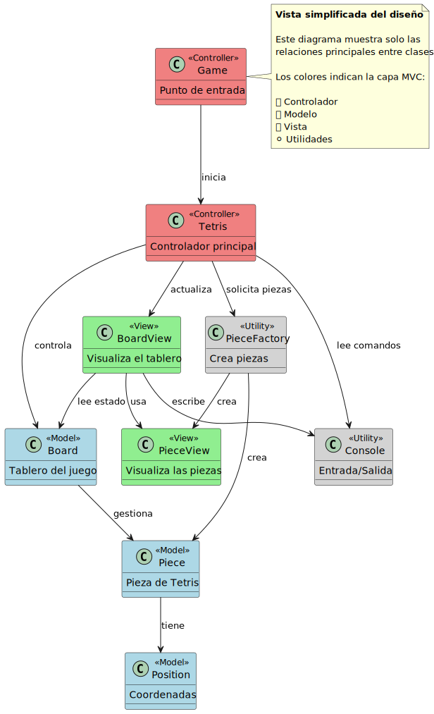
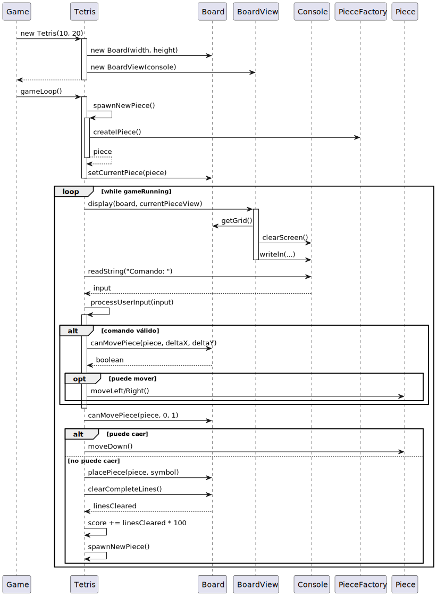

<div align=center>

|Observar||Conceptualizar||Decidir||Construir||Ejecutar|
|:-:|:-:|:-:|:-:|:-:|:-:|:-:|:-:|:-:|
|[Modelo del dominio](/docs/modeloDelDominio.md)|>>|[Análisis](/docs/ProcesoAnalisis.md)|>>|[Decisiones tecnológicas](/docs/DecisionesTecnologicas.md)|>>|[***Diseño***](/docs/ProcesoDiseño.md)|>>|[Código](/src/)

</div>

# Proceso de diseño

El **diseño** es la fase donde materializamos las decisiones tecnológicas en **código ejecutable**. Aquí definimos:

- Clases y métodos específicos
- Algoritmos concretos
- Estructuras de datos detalladas
- Flujos de control precisos

## Metodología

### 1. Análisis de las decisiones tecnológicas

**Input:** Decisiones del documento anterior

- Java como lenguaje
- MVC como arquitectura
- Arrays para representación de datos
- Consola como interfaz
- Factory Method para creación

**Pregunta clave:** *¿Cómo traducimos cada decisión en código concreto?*

### 2. Diseño de la arquitectura MVC

<div align=center>

|Diagrama de clases (simple)
|:-:
|
|[Diagrama de clases completo](../images/modelosUML/DiagramaDiseño.svg)

</div>

#### Identificación de capas

<div align=center>

|Modelo|Vista|Controlador|
|:-:|:-:|:-:|
|***Contiene la lógica de negocio***|***Maneja la presentación***|***Coordina modelo y vista***|
|Independiente de la interfaz|Traduce datos del modelo a visualización|Maneja la lógica de control|
|Representa el estado del juego|Gestiona I/O con el usuario|Procesa entrada del usuario|
||||
|[Board.java](../src/Board.java)|[BoardView.java](../src/BoardView.java)|[Tetris.java](../src/Tetris.java)|
|[Piece.java](../src/Piece.java)|[PieceView.java](../src/PieceView.java)|[Game.java](../src/Game.java)|
|[Position.java](../src/Position.java)|[Console.java](../src/Console.java)||
|[PieceFactory.java](../src/PieceFactory.java)|||

</div>

### 3. Diseño detallado (clase por clase)

#### Clase `Position`

##### Decisión de diseño

Clase simple con coordenadas enteras.

```java
public class Position {
    private int x, y;  // Coordenadas exactas
    
    // Constructor básico
    public Position(int x, int y)
    
    // Getters/Setters estándar
    public int getX(), setX(int x)...
    
    // Operación de suma para movimientos
    public Position add(Position other)
}
```

##### Justificación

- Encapsulación de coordenadas
- Reutilizable para cualquier posición 2D
- Operaciones matemáticas básicas

#### Clase `Piece`

##### Decisión de diseño

Shape como boolean[][] + Position

```java
class Piece {
    private boolean[][] shape;  // Forma de la pieza
    private Position position;  // Ubicación actual
    
    public Piece(boolean[][] shape)  // Constructor con forma
    
    // Movimientos básicos
    public void moveDown(), moveLeft(), moveRight()
    
    // Rotaciones con algoritmo de transposición de matriz
    public void rotateClockwise(), rotateCounterClockwise()
}
```

##### Decisión crítica: algoritmo de rotación

```java
// Rotación horaria: [i][j] → [j][rows-1-i]
for (int i = 0; i < rows; i++) {
    for (int j = 0; j < cols; j++) {
        rotated[j][rows - 1 - i] = shape[i][j];
    }
}
```

##### Justificación

- Representación visual intuitiva
- Algoritmo de rotación matemáticamente correcto
- Fácil detección de colisiones

#### Clase `Board`

##### Decisión de diseño

Grid como char[][] + lógica de validación

```java
public class Board {
    private char[][] grid;      // Estado permanente
    private int width, height;  // Dimensiones
    private Piece currentPiece; // Pieza activa
    
    // Validación de movimientos (algoritmo clave)
    public boolean canMovePiece(Piece piece, int deltaX, int deltaY)
    
    // Colocación permanente
    public void placePiece(Piece piece, char symbol)
    
    // Eliminación de líneas (algoritmo complejo)
    public int clearCompleteLines()
}
```

##### Algoritmo de validación de movimientos

```java
for (int i = 0; i < shape.length; i++) {
    for (int j = 0; j < shape[i].length; j++) {
        if (shape[i][j]) {  // Solo celdas ocupadas
            int newX = pos.getX() + j + deltaX;
            int newY = pos.getY() + i + deltaY;
            
            // Verificar límites y colisiones
            if (newX < 0 || newX >= width || newY >= height)
                return false;
            if (newY >= 0 && grid[newY][newX] != '.')
                return false;
        }
    }
}
```

##### Algoritmo de eliminación de líneas

```java
for (int i = height - 1; i >= 0; i--) {
    boolean isComplete = true;
    // Verificar si línea está completa
    for (int j = 0; j < width && isComplete; j++) {
        if (grid[i][j] == '.') isComplete = false;
    }
    
    if (isComplete) {
        // Desplazar líneas hacia abajo
        for (int k = i; k > 0; k--) {
            for (int j = 0; j < width; j++) {
                grid[k][j] = grid[k - 1][j];
            }
        }
        // Limpiar línea superior
        for (int j = 0; j < width; j++) {
            grid[0][j] = '.';
        }
        linesCleared++;
        i++; // Revisar la misma posición otra vez
    }
}
```

#### Clase `PieceFactory`

##### Decisión de diseño

Factory Method con formas hardcodeadas

```java
public class PieceFactory {
    public static Piece createIPiece() {
        boolean[][] shape = {
            { true, true, true, true }
        };
        return new Piece(shape);
    }
    
    public static PieceView createIPieceView() {
        return new PieceView('I');
    }
    // ... otros tipos
}
```

##### Justificación

- Centraliza la creación de piezas
- Garantiza formas válidas
- Fácil mantenimiento de tipos

#### Clase `BoardView`

##### Decisión de diseño

Separación entre datos y visualización

```java
public class BoardView {
    private Console console;
    
    public void display(Board board, PieceView currentPieceView) {
        // 1. Crear grid temporal para visualización
        char[][] displayGrid = new char[height][width];
        
        // 2. Copiar estado permanente
        // 3. Renderizar pieza actual encima
        // 4. Mostrar con marcos decorativos
    }
}
```

##### Algoritmo de renderizado

```java
// Copiar grid permanente
for (int i = 0; i < height; i++) {
    for (int j = 0; j < width; j++) {
        displayGrid[i][j] = grid[i][j];
    }
}

// Renderizar pieza actual encima (sin modificar modelo)
if (currentPieceView != null) {
    currentPieceView.render(piece, displayGrid);
}
```

#### Clase `Tetris` (Controlador)

##### Decisión de diseño

Game loop con procesamiento síncrono

```java
public class Tetris {
    // Componentes del sistema
    private Board board;
    private BoardView boardView;
    private Console console;
    private PieceView currentPieceView;
    
    public void gameLoop() {
        spawnNewPiece();
        while (gameRunning) {
            // 1. Mostrar estado actual
            boardView.display(board, currentPieceView);
            
            // 2. Capturar entrada del usuario
            String input = console.readString("Comando: ");
            processUserInput(input);
            
            // 3. Aplicar gravedad
            // 4. Verificar game over
        }
    }
}
```

##### Algoritmo de spawn de piezas

```java
Piece[] pieces = {
    PieceFactory.createIPiece(),
    PieceFactory.createOPiece(),
    PieceFactory.createTPiece(),
    PieceFactory.createLPiece()
};

int randomIndex = (int) (Math.random() * pieces.length);
board.setCurrentPiece(pieces[randomIndex]);
```

### 4. Patrones de diseño aplicados

#### Modelo-Vista-Controlador

- **Problema:** Separación de responsabilidades
- **Solución:** Capas bien definidas con interfaces claras
- **Beneficio:** Mantenibilidad y testabilidad

#### Factory method

- **Problema:** Creación compleja de diferentes tipos de piezas
- **Solución:** `PieceFactory` con métodos estáticos especializados
- **Beneficio:** Centralización y consistencia

#### Template method (implícito)

- **Problema:** Secuencia fija del game loop
- **Solución:** `gameLoop()` define la estructura, métodos específicos los detalles
- **Beneficio:** Flujo de control predecible

### 5. Los "por qué no!"

Se incluyen a continuación decisiones concientes de no implementación, junto con la justificación de por qué no.

#### Patrón Observer para actualización de vistas

- **Complejidad innecesaria:** Para un juego con un único observador (BoardView), Observer añade abstracción sin beneficio
- **Flujo síncrono simple:** El game loop ya controla cuándo actualizar la vista
- **Decisión:** Llamada directa a `boardView.display()` cuando es necesario

#### Sistema de eventos

- **Sobreingeniería:** Los comandos son simples (4, 6, 7, 9)
- **Flujo predecible:** Entrada → Procesamiento → Actualización
- **Decisión:** Switch simple en `processUserInput()`

#### Herencia para tipos de piezas

- **Sin comportamiento diferenciado:** Todas las piezas se mueven y rotan igual
- **Solo difieren en datos:** La forma inicial
- **Decisión:** Composición con factory (ver `[valeLaPenaLaHerencia.md](valeLaPenaLaHerencia.md)`)

#### Threading para animación fluida

- **Complejidad de sincronización:** Requiere manejo de concurrencia
- **Objetivo educativo:** Mantener el código comprensible
- **Decisión:** Game loop síncrono con entrada bloqueante

#### Persistencia de puntuaciones

- **Fuera del alcance:** No era requisito
- **Complejidad adicional:** Manejo de archivos o base de datos
- **Decisión:** Puntuación solo en memoria durante la sesión

### 6. Decisiones de algoritmos específicas

#### Detección de colisiones

**Decisión:** Verificación exhaustiva por cada celda ocupada

- **Alternativa considerada:** Bounding box
- **Justificación:** Precisión total, simplicidad de implementación

#### Rotación de piezas

**Decisión:** Transposición matemática de matrices

- **Alternativa considerada:** Formas pre-calculadas
- **Justificación:** Flexibilidad, menos memoria

#### Eliminación de líneas

**Decisión:** Desplazamiento in-situ hacia abajo

- **Alternativa considerada:** Reconstruir grid completo
- **Justificación:** Eficiencia, preserva estado

### 7. Manejo de errores y casos límites

#### Rotación en rordes

```java
boolean canRotate = canMovePiece(piece, 0, 0);
if (!canRotate) {
    // Deshacer rotación
    if (clockwise) {
        piece.rotateCounterClockwise();
        piece.rotateCounterClockwise();
        piece.rotateCounterClockwise();
    }
}
```

#### Game over!

```java
if (!board.canMovePiece(board.getCurrentPiece(), 0, 0)) {
    gameRunning = false;
}
```

### 9. Flujo de interacción: Game Loop

<div align=center>

|
|:-:
|*Flujo de control principal + interacción entre componentes + ciclo de vida de una pieza*

</div>


### 10. Optimizaciones implementadas

#### Renderizado eficiente

- Grid temporal solo para visualización
- No modifica el modelo durante renderizado

#### Validación temprana

- `canMovePiece()` termina en el primer conflicto
- Evita verificaciones innecesarias

#### Reutilización de objetos

- `Position` reutilizable
- `Console` singleton implícito

## Trazabilidad: decisiones → código

<div align=center>

|Decisión tecnológica|Implementación final|Archivos|
|-|-|-|
|Array 2D para tablero|`char[][] grid` en `Board`|`Board.java:10`|
|Factory Method|`PieceFactory` con métodos estáticos|`PieceFactory.java:1-49`|
|MVC|Separación en packages conceptuales|Todo el src/|
|Entrada síncrona|`console.readString()` en game loop|`Tetris.java:61`|
|Rotación matricial|`rotateClockwise()` con transposición|`Piece.java:34-45`|

</div>

## Validación del diseño

### Cohesión y acoplamiento

<div align=center>

|Métrica|Valor|Evaluación|
|-|:-:|-|
|Clases con responsabilidad única |9/9|Excelente|
|Dependencias por clase (promedio) |2.1|Bajo acoplamiento|
|Métodos por clase (promedio) |6.7|Tamaño manejable|
|Clases sin estado mutable compartido |8/9|Muy bien|

</div>

### Complejidad

<div align=center>

|Clase|Líneas|Método más largo|Complejidad ciclomática máx|
|-|:-:|-|-|
|Board|115|clearCompleteLines (26)|4 (clearCompleteLines)|
|Piece|58|rotateClockwise (12)|2 (rotaciones)|
|Tetris|84|gameLoop (35)|5 (gameLoop)|
|BoardView|35|display (28)|2 (display)|

</div>

- Todos los métodos < 40 líneas
- Complejidad ciclomática baja (< 10)

### Principios SOLID

- **S**ingle Responsibility: Cada clase tiene un propósito claro
- **O**pen/Closed: PieceFactory permite añadir piezas sin modificar
- **L**iskov Substitution: N/A (sin herencia)
- **I**nterface Segregation: N/A (sin interfaces)
- **D**ependency Inversion: Dependencias concretas (aceptable dada la naturaleza del proyecto)

### Criterios cumplidos

<div align=center>

|Funcionalidad|Calidad|Mantenibilidad|
|-|-|-|
|Todas los elementos del análisis implementados|Código legible y bien estructurado|Fácil agregar nuevos tipos de piezas|
|Lógica de Tetris correcta y completa|Separación clara de responsabilidades|Fácil cambiar interfaz sin afectar lógica|
||Patrones de diseño apropiados|Clases cohesivas con bajo acoplamiento|

</div>

### Compromisos

<div align=center>

||Rendimiento vs Simplicidad|Flexibilidad vs Complejidad|
|-|-|-|
|**Decisión**|Priorizar código claro sobre optimización|Implementación directa sin sobreingeniería|
|**Impacto**|Suficiente para el propósito educativo|Fácil de entender y extender|

</div>

## Conclusión

El proceso de diseño ha transformado exitosamente:

1. **Conceptos abstractos** ([análisis](ProcesoAnalisis.md)) → **Clases concretas** ([código](/src/))
2. **[Decisiones tecnológicas](DecisionesTecnologicas.md)** → **Algoritmos específicos**
3. **[Relaciones conceptuales](modeloDelDominio.md)** → **Referencias y métodos**
4. **Responsabilidades** → **Métodos implementados**

El resultado es un código que:

- **Implementa fielmente** los requisitos del análisis
- **Materializa correctamente** las decisiones tecnológicas
- **Mantiene trazabilidad** desde concepto hasta línea de código
- **Es mantenible y extensible** para futuros cambios

**La cadena completa está cerrada:** Análisis → Decisiones → Diseño → Código ejecutable.

### Decisiones acertadas

|Separación MVC desde el inicio|Factory para piezas|Algoritmos junto a los datos para grid|
|-|-|-|
|Facilitó las pruebas manuales|Centralización exitosa|Eficientes y comprensibles|
|Permitió cambiar la visualización sin tocar la lógica|Fácil añadir nuevos tipos|Evitan copias innecesarias|
|Claridad conceptual para estudiantes|Garantiza consistencia pieza-vista|Buen ejemplo de manipulación de arrays|

### Decisiones cuestionables (con justificación!!!)

||Game loop síncrono|Comandos numéricos (4,6,7,9)|Sin preview de siguiente pieza|
|-|-|-|-|
|**Limitación:**|Una acción por "frame"|No intuitivo para usuarios nuevos|Experiencia de juego incompleta|
|**Justificación:**|Simplicidad didáctica|Simplicidad de implementación|No estaba en los requisitos|
|**Alternativa futura:**|Timer + Thread para caída automática|WASD o flechas con librería de terminal|Panel lateral con siguiente pieza|

### A recordar, para futuros proyectos

#### La simplicidad es una característica, no un defecto

- Mejor empezar simple y refactorizar que sobre-diseñar
- Código educativo != Código de producción

#### Los patrones deben justificarse con necesidades reales

- *¿Para qué herencia si no hay comportamiento polimórfico?*
- *¿Para qué Observer si no hay múltiples observadores?*
- *¿Para qué Strategy si no hay estrategias intercambiables?*

#### La documentación del "por qué NO" es tan valiosa como el "por qué SÍ"

- Demuestra consideración consciente
- Educa sobre compromisos
- Previene sobreingeniería futura
