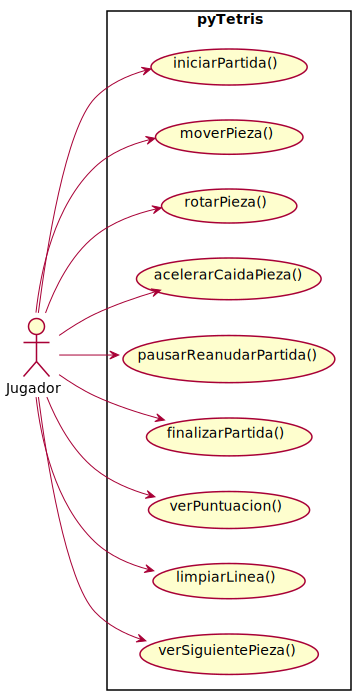

|Observar||Conceptualizar||Decidir||Construir||Ejecutar|
|:-:|:-:|:-:|:-:|:-:|:-:|:-:|:-:|:-:|
|[Modelo del dominio](/docs/modeloDelDominio.md)|>>|[***Requisitos***](/docs/ProcesoRequisitos.md)|>>|[Análisis](/docs/ProcesoAnalisis.md)|>>|[Decisiones tecnológicas](/docs/DecisionesTecnologicas.md)|>>|[Diseño](/docs/ProcesoDiseño.md)|>>|[Código](/src/)

# Proceso de requisitos

En esta fase se identifican los actores y los casos de uso principales del sistema pyTetris, sirviendo de puente entre el modelo del dominio y el análisis. El objetivo es capturar las interacciones clave que un usuario puede tener con el sistema.

## Actor principal

- **Jugador**: Persona que interactúa con el juego, controla las piezas y toma decisiones.

## Casos de uso identificados

- Iniciar partida
- Mover pieza
- Rotar pieza
- Acelerar caída de pieza
- Pausar/reanudar partida
- Finalizar partida
- Ver puntuación
- Limpiar línea
- Ver siguiente pieza

## Diagrama de casos de uso

El diagrama de casos de uso para el actor Jugador y los casos identificados se encuentra en el archivo externo:

[modelosUML/DiagramaCasosDeUso.puml](../modelosUML/DiagramaCasosDeUso.puml)

Puedes visualizarlo con cualquier herramienta compatible con PlantUML.

A continuación, se muestra el diagrama exportado en formato SVG:

## Reflexión: Tensión entre requisitos y desarrollo real

En este proyecto, la documentación de requisitos y casos de uso se ha realizado siguiendo el enfoque ortodoxo de la ingeniería de software, donde los requisitos guían el análisis, el diseño y la implementación. Sin embargo, en la práctica, el desarrollo de pyTetris ha seguido un camino más directo: desde el modelo del dominio se pasó casi inmediatamente al análisis y a la programación, sin una fase intermedia de requisitos detallados.

Esto genera una tensión interesante:
- Los casos de uso y requisitos documentados no siempre tienen una correspondencia 1:1 con los métodos y clases del análisis y el código.
- Muchas funcionalidades ya estaban claras y resueltas desde el modelo de dominio y el conocimiento del juego, haciendo que la fase de requisitos sea más una formalidad didáctica que una necesidad real del proyecto.

**¿Qué hacer ante esta tensión?**

- Reconocer que, en proyectos pequeños o con dominio muy claro, el proceso puede ser más iterativo y menos lineal de lo que sugieren los manuales.
- Usar la documentación de requisitos como herramienta de trazabilidad y reflexión, más que como guía estricta del desarrollo.
- Plantear dos caminos para compatibilizar ambos enfoques:
  - **Camino ortodoxo:** Mantener la documentación formal de requisitos y mapear explícitamente cada caso de uso a elementos del análisis y el código.
  - **Camino ligero:** Documentar solo los requisitos esenciales y centrarse en la trazabilidad práctica entre funcionalidades y su implementación.

Esta reflexión puede servir como punto de partida para decidir, en futuros proyectos, qué nivel de formalidad y documentación es realmente útil según el contexto y los objetivos. 